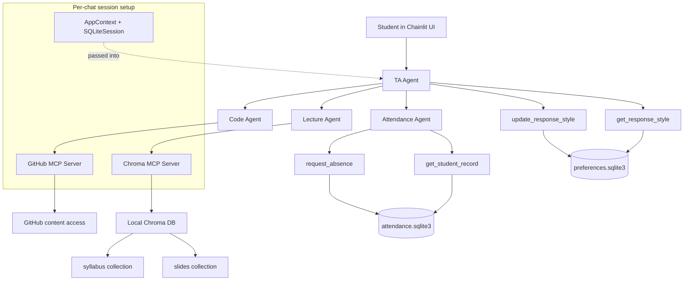

# Architecture

This diagram shows how the Chainlit app, top-level TA agent, delegated agents,
custom tools, MCP servers, and local data stores fit together.

## Notes

- The `TA Agent` is the only agent that speaks directly to the user.
- Response-style tools are attached directly to the `TA Agent`.
- Attendance tools are attached to the `Attendance Agent`.
- The `Lecture Agent` uses the Chroma MCP server.
- The `Code Agent` uses the GitHub MCP server.
